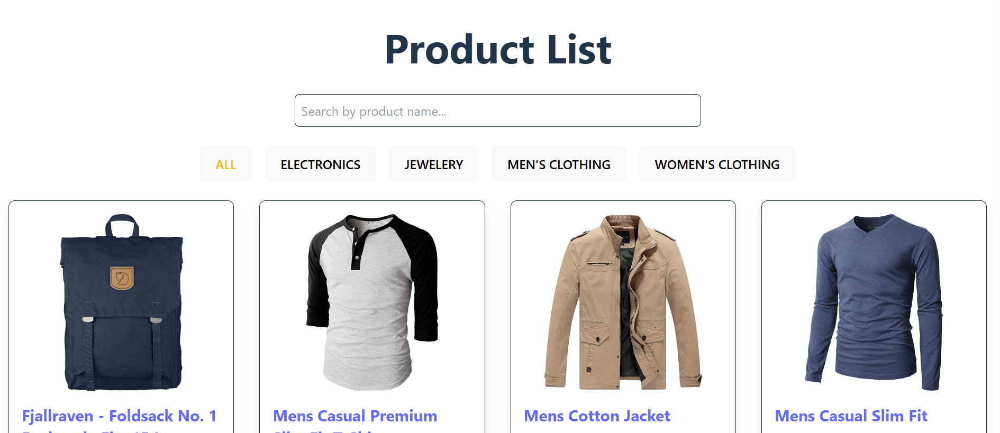

<h1 style="color: yellowgreen;font-family: 'Times New Roman', serif;">LIVE PREVIEW</h1>

[**PREVIEW LINK**](https://muhammedjasim961.github.io/E-Commerce-Application/)



<h1 style="color: yellow;font-family: 'Times New Roman', serif;"> FakeStore E-Commerce Application</h1>

## Description

This project is a fully functional e-commerce application built with React, Redux Toolkit, and Tailwind CSS. It utilizes the FakeStore API to display product listings with pagination, filtering, and search functionality. The project also features a product detail page and cart management using Redux.

## ⚙️ **Features**

### ✅ **Core Features**

- **Product Listing**: Display all products fetched from the FakeStore API.
- **Product Details**: View detailed information about each product.
- **Category Filtering**: Filter products by category.
- **Search Functionality**: Search for products by name.
- **Pagination**: Paginate through product listings for better navigation.
- **Cart Management**: Add, view, and remove items from the cart.
- **Total Price Calculation**: Displays the total price of all items in the cart.
- **Redux State Management**: Efficiently manages product and cart data using Redux Toolkit.
- **Responsive Design**: Fully responsive for both desktop and mobile screens.

---

## Technologies Used

- **React.js**: Component-based UI development.
- **Redux Toolkit**: State management.
- **Tailwind CSS**: Styling.
- **FakeStore API**: Mock product data.
- **Vite**: Fast build tool and development server.

## Installation and Setup

1. Clone the repository:

```bash
git clone <https://github.com/Muhammedjasim961/E-Commerce-Application.git>
cd fakestore-app
```

2. Install dependencies:

```bash
npm install
```

3. Start the development server:

```bash
npm run dev
```

4. Open your browser and navigate to:

```
http://localhost:5173
```

## Project Structure

```
/src
┣ 📁 components        # Reusable React components
┃ ┣ 📄 Navbar.jsx      # Navigation bar with search
┃ ┣ 📄 ProductList.jsx # Main product listing with pagination
┃ ┣ 📄 ProductDetail.jsx  # Single product details
┃ ┣ 📄 Cart.js         # Cart functionality
┣ 📁 pages
┃ ┣ 📄 Home.jsx        # Home page with products
┣ 📁 redux             # Redux store and slices
┃ ┣ 📄 store.js        # Redux store configuration
┃ ┣ 📄 cartSlice.js    # Cart management
┃ ┣ 📄 productSlice.js # Product management
┣ 📁 assets            # Images, icons, or static files
┣ 📄 App.jsx           # Main app component
┣ 📄 main.jsx          # Entry point for ReactDOM rendering
┣ 📄 index.css         # Global styles
┣ 📄 vite.config.js    # Vite configuration
┣ 📄 package.json      # Project dependencies and scripts
```

## API Reference

- [FakeStore API](https://fakestoreapi.com/)

## ✅ API Endpoints Used:

- **Get All Products**: https://fakestoreapi.com/products
- **Get Single Product**: https://fakestoreapi.com/products/:id
- **Get Categories**: https://fakestoreapi.com/products/categories

## License

This project is licensed under the [MIT License](LICENSE).
